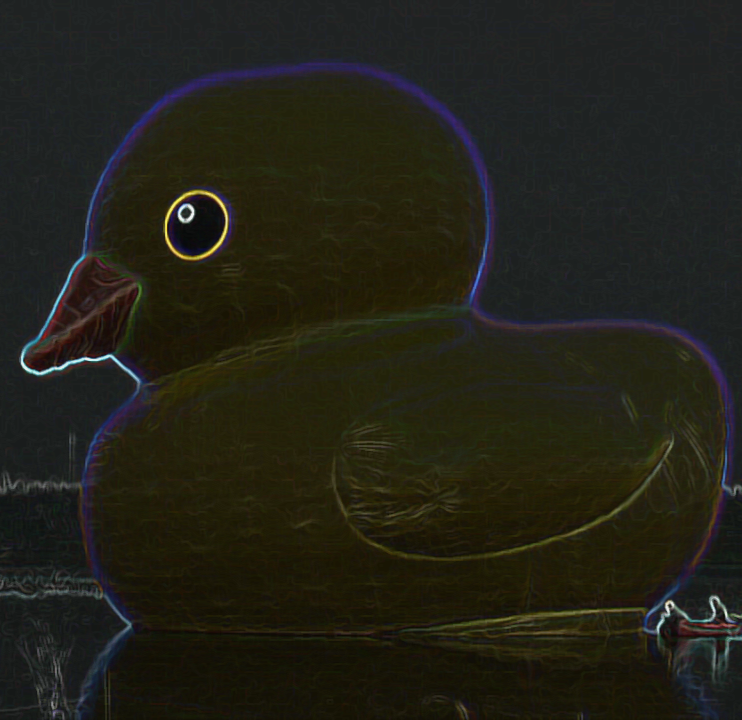

# About Us

We are a team based in the [School of Computing, National University of Singapore](http://www.comp.nus.edu.sg).

You can reach us at the email `seer[at]comp.nus.edu.sg`

## Project team

### John Doe

[[homepage](http://www.comp.nus.edu.sg/~damithch)]
[[github](https://github.com/johndoe)]
[[portfolio](team/johndoe.md)]

* Role: Project Advisor

### Lim Rui Yuan

[[github](https://github.com/oolimry/)]

* Role: Slacker
* Responsibilities: Keep Jinxia in Check

### Pan Jinxia

[[github](https://github.com/panjx-7339/)]

* Role: Developer
* Responsibilities: Data

### Song Yiyang

[[github](https://github.com/song-yiyang)]

* Role: Developer
* Responsibilities: Dev Ops + Threading

### Tan Ze Jian

[[homepage](https://onetw0three.github.io/)]
[[github](http://github.com/onetw0three)]

* Role: Integration, Code Quality
* Responsibilities: In charge of versioning of the code, maintaining the code repository, integrating various parts of the software to create a whole. Looks after code quality, ensures adherence to coding standards,
